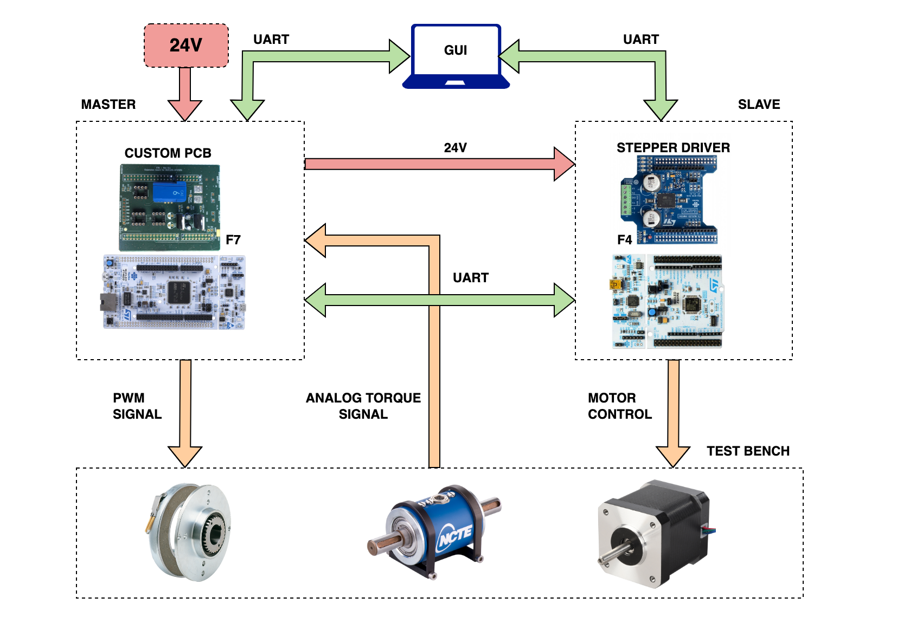

# STB master
The StepperTestBench (STB) master unit is written in C using STM32CubeMX. The systems allows to control the magnetic brake and read the analog torque sensor. 
The master unit communicates both with the GUI and the slave unit using the serial UART protocol.

## Code Flowchart

A finite-state machine (FSM) model has been chosen to describe and formalize the master unit be- haviour. Since the device has to deal with an __automatic test__ and a __manual test__, the FSM is basically divided in two sequential branches. The first one is aimed to handle a synchronous event (the automatic test), where every action of the unit is time dependent and at the same time is slave- message subordinate. To give an example, in the first branch it is not possible to read the analog sensors before the receiving of a `start-motor` message acknowledgment from the slave. On the other hand the second branch is __slave-independent__, so it is possible to manage a braking command or a reading sensors in an _asynchronous way_, without considering the current state of the slave. To give another example, during a manual test, it is possible to read the sensors or pilot the brake even when the slave is not driving the motor, as this branch is totally slave-independent. Note that a manual test has no need to start from a specific condition, indeed when the master is not operating an automatic test, every command is interpreted as a manual test command. The entire FSM flowchart is reported in figure 5.1.
When an automatic test is launched with the GUI, the master unit sends to the slave a `start_motor` command and then waits for a fixed time in order to receive an acknowledging message from the slave to know if the motor is running. The sending and waiting operation respects a fixed timing defined by the multiplication of the macros `MAX_CMD_SEND_ATTEMPTS` and `MAX_ACK_ALLOWED_DELAY_MS`. If the slave does not respect this timing, the test must be re-launched by the GUI; otherwise if it is respected, the master starts to acquire the ADCs values and sends them to the GUI, while piloting gradually the brake, until the total duration of the test. Then the brake is released and a `stop_motor` command is sent with the same acknowledgement procedure.

## Build and flash the project
Open the project with VSCode and install the [stm32-for-vscode](https://marketplace.visualstudio.com/items?itemName=bmd.stm32-for-vscode#:~:text=An%20extension%20to%20compile%2C%20debug,STM32%20for%20VSCode%20configuration%20file.) extension.

The you can just use the Build button and the Flash one to upload the firmware.

_This gif is taken from the stm32-for-vscode extension_