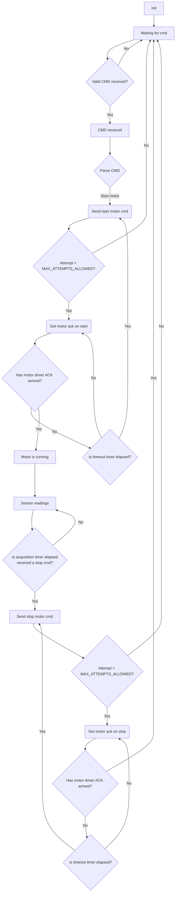

# STB Master flowchart

```mermaid
graph TD

A[Init] --> B[Waiting for cmd]
B --> B1{Valid CMD received?}
B1 --> |No| B
B1 --> |Yes| B2[CMD received]
B2 --> B3{Parse CMD}
B3 --> |Start motor| C(Send start motor cmd)
C --> CA{Attempt < MAX_ATTEMPTS_ALLOWED?}
CA --> |No|B
CA --> |Yes|C1(Get motor ack on start)
C1 --> C2{Has motor driver ACK arrived?}
C2 --> |No| C3{Is timeout timer elapsed?}
C3 --> |No|C1
C3 --> |Yes|C
C2 --> |Yes| D[Motor is running]
D --> E[Sensor readings]
E --> F{Is acquisition timer elapsed<br>received a stop cmd?}
F --> |No|E
F --> |Yes|G[Send stop motor cmd]
G --> G0{Attempt < MAX_ATTEMPTS_ALLOWED?}
G0 --> |Yes|G1(Get motor ack on stop)
G0 --> |No|B
G1 --> G2{Has motor driver ACK arrived?}
G2 --> |Yes|B
G2 --> |No|G3{Is timeout timer elapsed?}
G3 --> |No|G1
G3 --> |Yes|G
```