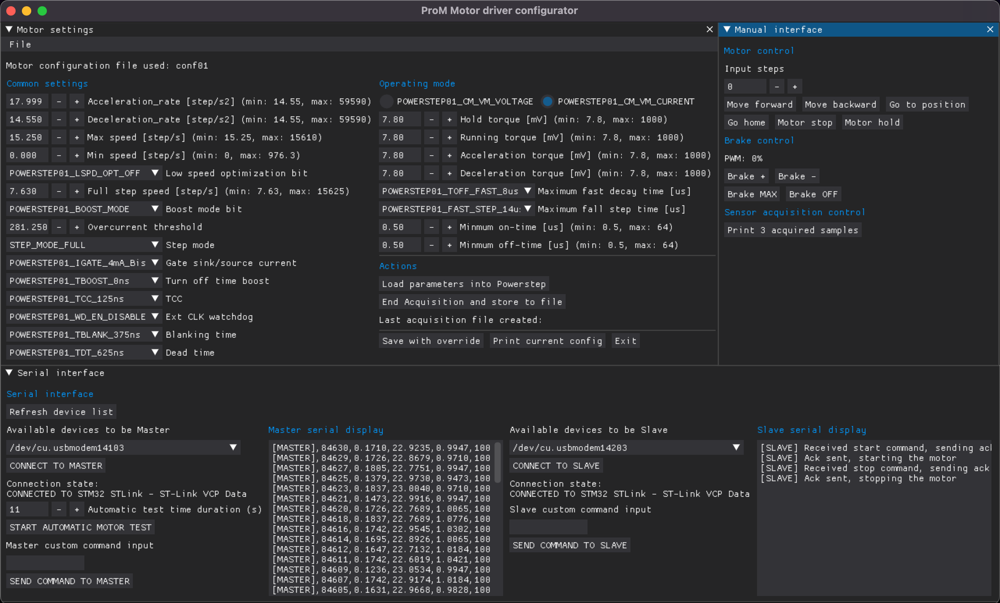
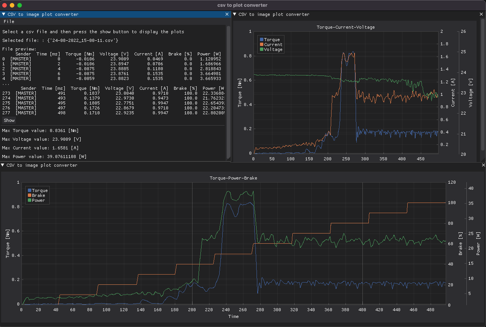

# Stepper Testbench GUI
The GUI is made up of two main windows: the first one is used to control the motor driver parameters, to test the motor under load, to communicate with both units using serial communication and to save the acquired data into a csv file. The second one is used to plot the acquired data into some.

The second one is used to read the sensors values and to plot the acquired data in a dynamic way. 

# GUI Installation
    cd src
    pip3 install -r requirements.txt
# Usage
## Open STB motor dashboard
    python3 main.py

## Open CSV to plot handler
    python3 csv_to_plot_guy.py

## Store CSV datas into some pdf plots 
    cd csv
    python3 save_plot.py {csv_file.csv | last}

Note 1: The scripts takes one arguement which can be a csv (which contains the acquired) or the `last` keyword.
If `last` is typed, the script will take last added csv file inside `csv` folder. 
Note 2: The .csv file must be inside the `csv` folder and it has to respect the following format `DD_MM_YYYY_HH_MM_SS.csv`