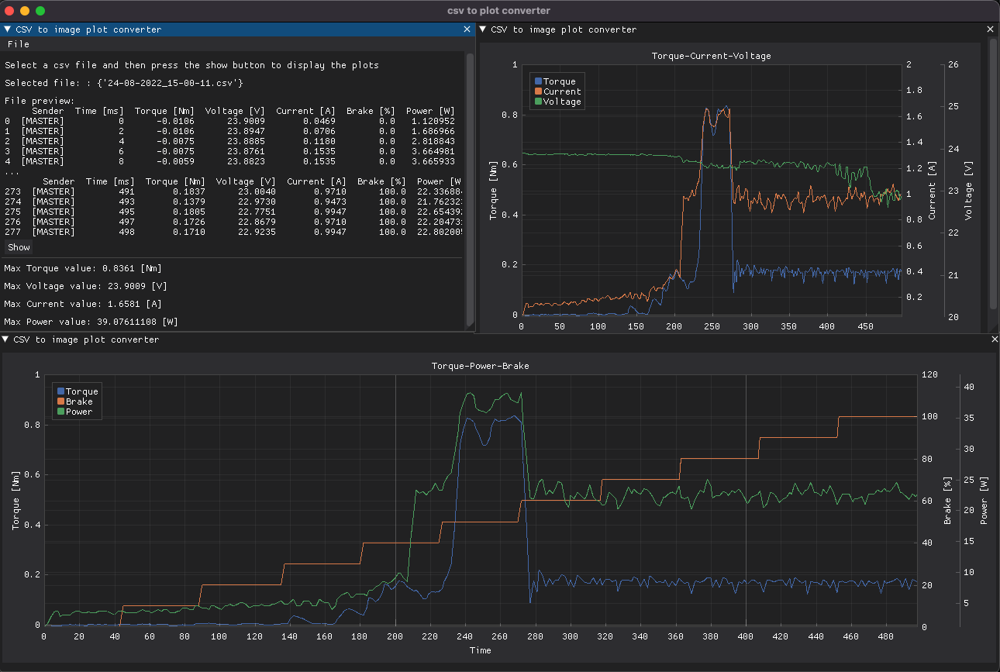

# Step-motor-test-bench

Step Motor Testbench is a tool made in collaboration with [ProM Facility](https://promfacility.eu/#/) which can be used to measure the __maximum power__ and the __maximum torque__ of a step motor.  
Notice that this is a prototype made up to validate the innovative company idea. 

## Functionalities
1. Driving the stepper motor
2. Driving the magnetic brake
3. Measuring the involved physical quantities such as: torque, voltage and current of the motor
4. Set the motor driver parameters and show the plots related to the obtained motor curves using a GUI (Graphical User Interface)

## Main components
- Step motor (device under test)
- Torque sensor
- Magnetic brake
- Master unit made of
    - Nucleo STM32 F7 Board
    - Custom PCB to handle different voltages and conditionate the signals
- Slave unit made of
    - Nucleo STM32 F4 Board
    - STM X-NUCLEO-IHM03A1 stepper driver extension board

## System block diagram

## Thesis abstract
This thesis reports the work done during my internship period at ProM Facility, the company - based in Rovereto (TN) - is focused on mechanics, electronics and informatics prototyping. This work principally covers the high level software development and at the same time the baremetal firmware development to support the innovative company project. In particular, ProM Facility had the necessity to prototype a __stepper motor test bench__ for an internal usage. This measurement tool is able to determine the __maximum power__ and __maximum torque__ provided by the under test motor.

At my arrival in the company the test bench mechanical structure was already built, ensuring the connection between a magnetic brake, a torque sensor and a stepper motor. To make the prototype actually working it has been necessary to integrate the hardware development with the software one. Obtaining the characteristic curves that describes the performance of the motor has been one of the main objectives of my work, in order to get this results sensors of voltage, current and torque have been used. Moreover, a wide variety of motor driver parameters selection has been implemented, in such a way to build a custom configuration with the purpose of optimize the produced curves by operating on the single parameters. However, this curve optimization task will be studied by the future company interns.

It has also been developed a dedicated graphical user interface to let the end user interacting with the test bench, with this software it is possible to change the motor driver parameters and test it under load; on the other hand, to read the sensors values and drive the motor, two units have been projected: _master_ and _slave_. The first one is made up of a _STM Nucleo F7_ board with a custom developed _shield_, where sensors and signal conditioning circuits have been soldered. The second one, instead, is composed of a _STM Nucleo F4_ board and an expansion driver board - the _STM X-NUCLEO-IHM03A1_ - necessary to control the motor under the F4 _microcontroller_ rules.

The thesis especially describes the development process to create the graphical interface using the Python programming language and to write the firmware of the master unit. For the last one a duo formed by the STM Cube MX software and the C language has been selected. Eventually, the remaining work, consisting of the slave firmware development and the prototyping of the expansion board for the master unit, has been up to the colleague with whom I have shared the internship experience, _Lisa Santarossa_.

As planned, the project has been concluded successfully, gathering the curves of __torque-power__ based on the custom configuration chosen by the end user.

__You can find the theseis [here](/Documentation/Tommaso_Canova_STB_thesis.pdf)__

## Repo structure
    ├── 📁 Documentation    -> media and thesis
    ├── 📁 Firmware         -> slave and master units firmware
    ├── 📁 GUI              -> graphical user iterface and plot scripts
    └── 📁 Hardware         -> custom master unit expansion board kicad project

## GUI screenshots
The GUI is made up of two main windows: the first one is used to control the motor driver parameters, to test the motor under load, to communicate with both units using serial communication and to save the acquired data into a csv file. The second one is used to plot the acquired data into some.

The second one is used to read the sensors values and to plot the acquired data in a dynamic way. 

